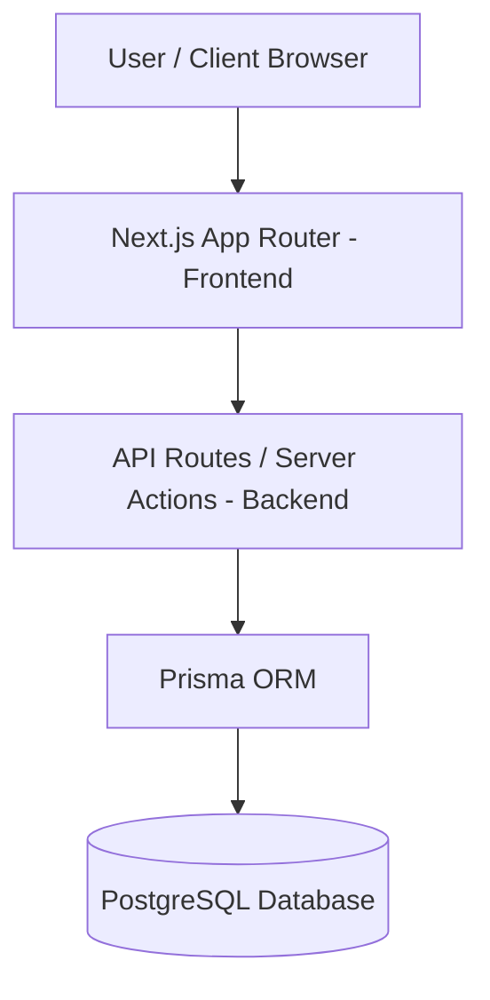

# 🌾 Farm-to-Table Marketplace

An end-to-end digital marketplace connecting local organic farmers directly with restaurants and bulk buyers.

---

## 🎯 Project Overview & Core Mission

- **Goal:** Eliminate traditional middlemen to provide fairer prices for farmers and fresher produce for restaurants.
- **Target Audience:** Local Farmers (Sellers), Restaurant Owners/Chefs (Buyers), and Platform Admins.

---

## 🏗️ System Architecture & Tech Stack

### Tech Stack

- **Frontend Framework:** Next.js (App Router), TypeScript, Tailwind CSS
- **Database & ORM:** PostgreSQL, Prisma ORM
- **Authentication:** NextAuth.js / Clerk
- **State Management:** React Context / Zustand

## 🚦 Features Roadmap

- [x] Project Initialization with Next.js & Tailwind CSS
- [ ] Database Schema Setup & Integration
- [ ] Product Browsing & Seasonal Filtering
- [ ] Shopping Cart & Bulk Order Checkout
- [ ] Farm Admin Dashboard for Inventory Management
- [ ] Delivery Status Tracking System
